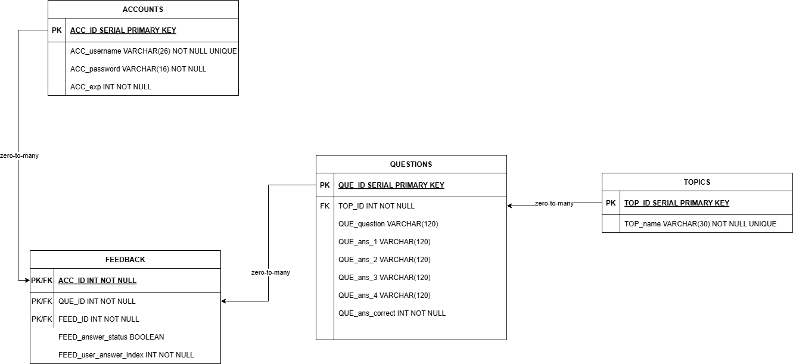

Database
========

| the database handles the storing of long term information from user accounts to questions and feedback, the database is written in sqlite.

ERD 
---

| Here you can see an overview of the design for the database we have 4 tables which each store information, an accounts table to store account data for users, a questions table to store questions, topics to group the questions by and a feedback table to store all the users answers for any quizzes the user has participated in. 

ACCOUNTS TABLE 
--------------
| This table holds data for user accounts.
============  ======================================================================================  ===========================================================================================================================
Attribute     Purpose                                                                                 Data type & constraints
============  ======================================================================================  ===========================================================================================================================
ACC_ID        Unique ID                                                                               SERIAL PRIMARY KEY
ACC_username  Unique username                                                                         VARCHAR(26) NOT NULL UNIQUE
ACC_password  Password, min length 8, requires 1 digit and 1 non-alphanumeric character for security  VARCHAR(16) NOT NULL CHECK (length(ACC_password)>=8 AND ACC_password GLOB '*[0-9]*' AND ACC_password GLOB '*[^a-zA-Z0-9]*')
ACC_exp       Account experience level tracking (unused)                                              INT NOT NULL CHECK(ACC_exp >= 0)
============  ======================================================================================  ===========================================================================================================================

| ACC_username is constrained as unique so that users can easily identify each other. 
| ACC_password has constraints which enforce use of digits and non-alphanumeric characters. 
| ACC_exp is currently unused, it was intended to allow accounts could have progression, but this feature was scrapped. 

FEEDBACK/QUIZ TABLE 
-------------------
======================  ======================================================================================  ===========================================================
Attribute               Purpose                                                                                 Data type & constraints
======================  ======================================================================================  ===========================================================
FEED_ID                 Identifier for feedback                                                                 INT NOT NULL 
ACC_ID                  Identifier for account                                                                  INT NOT NULL, REFERENCES ACCOUNTS (ACC_ID)
QUE_ID                  Question number in quiz                                                                 INT NOT NULL, REFERENCES QUESTIONS (QUE_ID)
FEED_answer_status      Answer correct/incorrect                                                       INT NOT NULL CHECK(ACC_exp >= 0)
FEED_user_answer_index  Which answer the user selected                                         INT NOT NULL CHECK (FEED_user_answer_index BETWEEN 0 AND 3)
======================  ======================================================================================  ===========================================================

| The feedback table intersects between the accounts and questions table, storing the results of a users quiz for use in feedback. 
| The table uses a composite key with FEED_ID, QUE_ID and ACC_ID: 
- FEED_ID differentiates each quiz/feedback object
- ACC_ID points to which user the feedback is for
- QUE_ID refers to which question the entry regards
- FEED_answer_status stores if the question was answered correctly.
- FEED_user_answer_index stores which option the user chose, allowing us to show the user what they got right/wrong. 

QUESTIONS TABLE 
---------------

===============  ======================================  ====================================================
Attribute        Purpose                                 Data type & constraints
===============  ======================================  ====================================================
QUE_ID           Unique question ID                      SERIAL PRIMARY KEY
TOP_ID           Topic ID                                INT NOT NULL, REFERENCES TOPICS (TOP_ID)
QUE_question     Question text                           VARCHAR(120) NOT NULL
QUE_ans_1        Answer 1 text                           VARCHAR(120) NOT NULL
QUE_ans_2        Answer 2 text                           VARCHAR(120) NOT NULL
QUE_ans_3        Answer 3 text                           VARCHAR(120) NOT NULL
QUE_ans_4        Answer 4 text                           VARCHAR(120) NOT NULL
QUE_ans_correct  Correct answer index (0-3)              INT NOT NULL CHECK (QUE_ans_correct BETWEEN 0 AND 3)
===============  ======================================  ====================================================

| The questions table stores all the questions.
| TOP_ID denotes the topic the question is associated with.
| QUE_question stores the question text. 
| QUE_ans_1-4 stores each of the 4 answers texts. 
| QUE_ans_correct stores which answer is correct, it is constrained to only accept an index of 0-3 matching the 4 possible answers. 

TOPIC TABLE 
-----------

| As mentioned above, each question is grouped by a topic.
| In the topic table we have a serial ID for the primary key and a unique TOP_name for a topic title. 

=========  ===============================  ===========================
Attribute  Purpose                          Data type & constraints
=========  ===============================  ===========================
TOP_ID     Unique topic ID                  SERIAL PRIMARY KEY
TOP_name   Topic name                       VARCHAR(30) NOT NULL UNIQUE
=========  ===============================  =========================== 
