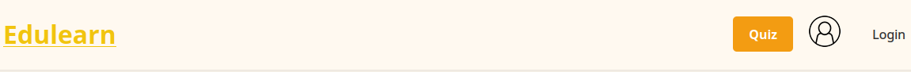
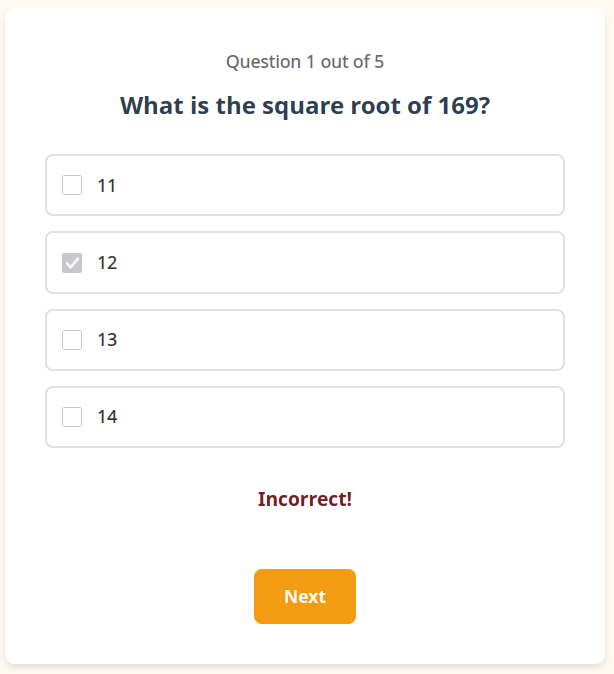
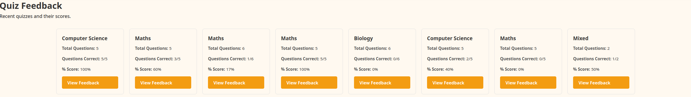
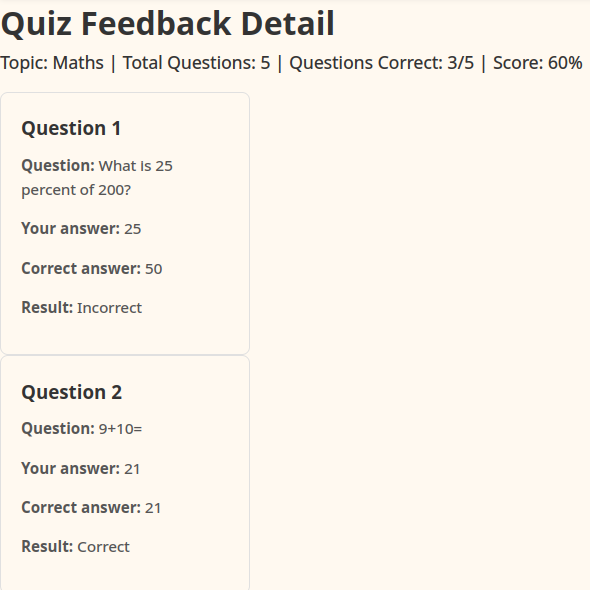

Frontend
========

| The frontend for Edulearn uses the Jinja templating engine, with pages written in HTML/CSS. 
| Some components use JavaScript to enable interactivity.  
| Here's a breakdown of the frontend, page-by-page:  

Navbar/base
-----------
| Using Jinja, we put the navbar into a 'base.html' template that is reused across all pages.  
| The navbar contains link buttons to the quiz, feedback list, and login pages.  
| The navbar is styled to cover the entirety of the top of the screen, and each of the links are styled a little differently:  
* The link to the start quiz form is styled with an orange background so it stands out
* The link to the feedback list has a profile icon (in future, we plan to have individual users be able to view their own feedback)
* The login link is styled plainly - black text on white (with orange text on hover)


| See the html:
.. code-block:: html

    <!DOCTYPE html>
    <html lang="en">
    <head>
    <meta charset="UTF-8">
    <meta name="viewport" content="width=device-width, initial-scale=1.0">
    <title>EduLearn</title>
    <link rel="stylesheet" href="{{ url_for('static', filename='style.css') }}">
    </head>
    <body>
    <header>
        <div class="header-container">
        <a href="/" class="logo">Edulearn</a>
        <nav class="nav-buttons">
            <a href="/start_quiz" class="start-learning-btn">Quiz</a>
            <a href="/profile"></a>
            <a href="/login" class="nav-btn">Login</a>
        </nav>
        </div>
    </header>

    <main>
        
    </main>

    
    </body>
    </html>
| Note that it looks like pretty standard HTML boilerplate, except that it includes some Jinja (usually denoted by curly braces) that allows it to work alongside other files.
|
| Other pages will use  to include this template.

Front page
----------
| The front page is the first thing users will see when visiting Edulearn.
.. image:: images/frontpage.png

| The main goal of this page is simply to push users to the meat of the website - the quiz functionality.
| See below a breakdown of the three major sections:

Hero section
````````````
| The front page has some blurb in a hero section, as well as linking to the start quiz form.
.. code-block:: html

    <section class="hero-section">
        <div class="hero-content">
            <h1>Welcome to EduLearn</h1>
            <p>Your one-stop platform for learning and testing your knowledge.</p>
            <a href="/start_quiz" class="start-learning-btn">Take a quick Quiz</a>
        </div>
    </section>
| Note that the link to start quiz form uses the same styling as the link within the navbar. 
Feature cards
`````````````
| There are a couple of swanky styled cards, but the styling is a little fiddly; the feature cards are wrapped in their own dedicated 'features-section', 'features-grid' and 'features-card' classes.
.. code-block:: html

    <section class="features-section">
        <h2>Why Choose EduLearn?</h2>
        <div class="features-grid">
            <div class="feature-card">
                <div class="feature-icon">
                    
                </div>
                <h3>Interactive Quizzes</h3>
                <p>Engaging challenges designed to test and reinforce your knowledge quickly.</p>
            </div>
            <div class="feature-card">
                <div class="feature-icon">
                    
                </div>
                <h3>Track Progress</h3>
                <p>Monitor  your performance over time and see exactly where you can improve.</p>
            </div>
        </div>
    </section>

| The feature cards float up a bit on hover, too:
.. code-block:: css 

    .feature-card:hover {
    transform: translateY(-5px);
   }

Call to action
``````````````
| The call to action section is, essentially, a repeat of the hero section.
| It has its own unique styling which makes it slightly smaller than the hero.

Start Quiz form
---------------
| The start quiz form allows users to choose from 3 different quiz topics.
.. image:: images/start_quiz_form.png

| There are spinboxes that allow users to pick a value from 3-20:
.. code-block:: html

    <input name="limit" type="number" min="3" max="20" step="1" value="10">

| These three boxes are each actually their own form; when clicked, they send the user to the quiz form, passing through the selected topic and desired number of questions.
.. code-block:: html

    <form action="/quiz" method="GET" class="topic-card">
      <h2>Mathematics</h2>
      <p>Test your knowledge in Algebra, Geometry, and Calculus.</p>
      <div class="topic-settings">
        <label>Number of questions:</label>
        <input name="limit" type="number" min="3" max="20" step="1" value="10">
      </div>
      <input type="hidden" name="topic" value="maths">
      <button type="submit" class="submit-btn">Take a quiz</button>
    </form>

| Note the form's 'action' property - this causes the submission to pass through the form's 'limit' and 'topic' values directly to the quiz form page.

.. _quiz-form:

Quiz form
---------
| The quiz form displays multiple-choice questions to users, showing them correct/incorrect on answer selection.


| Here's the code for the form itself:
.. code-block:: jinja

    <div class="container">
      <div class="question-box">
        
        <p id="questionCounter" class="question-counter">Question 1 out of {{ questions | length }}</p>

        
        
        <div class="question" id="question{{ qIndex }}" style="display: none;">
          <h2>{{ question.name }}</h2>
          <form class="quiz-form">
            
            <label class="option">
              <input type="checkbox" name="answer{{ qIndex }}" value="{{ loop.index0 }}">
              <span>{{ option }}</span>
            </label>
            
          </form>
        </div>
        

        <div id="feedback" class="feedback"></div>

        <div class="button-group">
          <button
            type="button"
            class="submit-btn"
            id="nextBtn"
            style="display: none;"
            disabled
          >Next</button>
          <button type="button" class="submit-btn" id="finishBtn" style="display: none;">Finish</button>
        </div>
        
        <article class="feedback-card">
          <p>{{ error or 'No questions to show.' }}</p>
        </article>
        
      </div>

    </div>

| Syntax highlighting for this code block is Jinja only, but it does help show how Jinja affords us the flexibility to dynamically render multiple form options based on provided data.
| The basic way to think of it is: this form takes a set of questions, which each contain a set of options.
| Jinja allows us to iterate over these bits of data and dynamically populate our form with it.
| The form also displays a fallback error message if there is no question data provided.
| The form itself expects to have all of the question data provided when it is loaded, it's not fetching back and forth multiple times in 1 quiz.

| You may still be confused on what we're doing with this empty 'feedback' div and the two submit buttons.
| This is where our JavaScript comes in:

Quiz form JS
````````````
| We have some functions relating to the form that let us play around with the form without having to leave the page.

showQuestion
************
| We have a showQuestion function that gets called when the Next question button is clicked, and on form initialisation.
| We start by sanitising the input question number, checking it isn't a bool and that it's a number between 1 and the quiz length:
.. code-block:: javascript

    function showQuestion(questionNumber) {
      if (typeof questionNumber === 'boolean') {
        return;
      }

      const parsedQuestionNumber = Number(questionNumber);
      if (!Number.isInteger(parsedQuestionNumber)) {
        return;
      }

      if (parsedQuestionNumber < 1 || parsedQuestionNumber > totalQuestions) {
        return;
      }

| For our given number, we show the relevant data, update question number, clear our correct/incorrect feedback and disable our next/finish button as necessary:
.. code-block:: javascript

      for (let i = 1; i <= totalQuestions; i++) {
        document.getElementById(`question${i}`).style.display = 'none';
      }

      document.getElementById(`question${parsedQuestionNumber}`).style.display = 'block';

      document.getElementById('questionCounter').textContent = `Question ${parsedQuestionNumber} out of ${totalQuestions}`;

      document.getElementById('nextBtn').style.display = parsedQuestionNumber < totalQuestions ? 'inline-block' : 'none';
      document.getElementById('nextBtn').disabled = true;
      document.getElementById('finishBtn').style.display = 'none';

      document.getElementById('feedback').textContent = '';
      document.getElementById('feedback').className = 'feedback';
    }

Finish/Next button clicks
*************************
.. code-block:: javascript

    document.getElementById('nextBtn').addEventListener('click', function() {
      if (currentQuestion < totalQuestions) {
        currentQuestion++;
        showQuestion(currentQuestion);
      }
    });

    document.getElementById('finishBtn').addEventListener('click', async function() {
      const payload = {answers: Object.values(userAnswers)};

      const response = await fetch('/api/submitQuiz', {
        method: 'POST',
        headers: { 'Content-Type': 'application/json' },
        body: JSON.stringify(payload)
      });
      const result = await response.json();
      console.log(result);

      // Redirect to index page
      window.location.href = '/';
    });


| The next button click is fairly self-explanatory: show the next question if we have one to show.
| Our finish button fires off our answers to the backend to eventually be stored as feedback objects.

Answer selection event
**********************
| Last but not least, our answer selection event:
.. code-block:: javascript

    // Enforce single-select behaviour and check answer on selection
    document.querySelectorAll('input[type="checkbox"]').forEach(checkbox => {
      checkbox.addEventListener('change', function() {
        const feedback = document.getElementById('feedback');

        if (this.checked) {
          document.querySelectorAll(`input[name="${this.name}"]`).forEach(cb => {
            if (cb !== this) cb.checked = false;
            cb.disabled = true;
          });

          const correctOption = questions[currentQuestion - 1].correctOption;
          if (parseInt(this.value) === correctOption) {
            feedback.textContent = 'Correct!';
            feedback.className = 'feedback correct';
          } else {
            feedback.textContent = 'Incorrect!';
            feedback.className = 'feedback incorrect';
          }

          if (currentQuestion < totalQuestions) {
            document.getElementById('nextBtn').disabled = false;
          } else {
            document.getElementById('finishBtn').style.display = 'inline-block';
          }

          userAnswers[currentQuestion - 1] = {
            qID: questions[currentQuestion - 1].id,
            selected: parseInt(this.value),
            isCorrect: parseInt(this.value, 10) === questions[currentQuestion - 1].correctOption
          }

        } else {
          feedback.textContent = '';
          feedback.className = 'feedback';
        }
      });
    });

| This will fire on any answer selection.
| Basically, it will:
* ensure that only one answer is selected (disable other options)
* update feedback to display correct/incorrect
* unlock next/finish button as appropriate
* store user answer (to send to backend on finish)
* if, somehow, the user has unchecked an answer, wipe feedback

Styling
```````
| Styling for the form itself is pretty light:
.. code-block:: css

    .quiz-form {
        display: flex;
        flex-direction: column;
        gap: 15px;
        text-align: left;
    }

    .option {
        display: flex;
        align-items: center;
        padding: 15px;
        border: 2px solid #e0e0e0;
        border-radius: 8px;
        cursor: pointer;
        transition: all 0.3s;
    }

    .option:hover {
        border-color: #f39c12;
        background-color: #fef5e7;
    }

    .option input[type="checkbox"] {
        width: 20px;
        height: 20px;
        margin-right: 15px;
        cursor: pointer;
    }

    .option span {
        font-size: 1.1rem;
        color: #333;
    }

    .submit-btn {
        margin-top: 20px;
        padding: 15px 30px;
        background-color: #f39c12;
        color: white;
        border: none;
        border-radius: 8px;
        font-size: 1.1rem;
        font-weight: 600;
        cursor: pointer;
        transition: background-color 0.3s;
    }

| The interactible buttons explicitly set the cursor to pointer, which helps make it a bit more clear to the user.
| The options flex nice and wide to fit the form, giving the user plenty of room to click.
| Everything follows the same off-white background + orange accent as the rest of the design.

Feedback list
-------------
| This page gives a summary of previously completed quizzes, with topic name and correct/incorrect answer counts.


| The main section of code for the quiz feedback list view:
.. code-block:: html

    <h1>Quiz Feedback</h1>
    <p>Recent quizzes and their scores.</p>

    <section class="module-grid">
      
        
        <article class="module-card">
          <h3>{{ quiz.topic|title }}</h3>
          <p><strong>Total Questions:</strong> {{ quiz.total_questions }}</p>
          <p><strong>Questions Correct:</strong> {{ quiz.correct_count }}/{{ quiz.total_questions }}</p>
          <p><strong>% Score:</strong> {{ quiz.score_percent|int }}%</p>
          <a href="/quiz_feedback?feed_id={{ quiz.feed_id }}" class="start-learning-btn">View Feedback</a>
        </article>
        
      
        <article class="module-card">
          <h3>No completed quizzes yet</h3>
          <p>Finish a quiz to see feedback here.</p>
        </article>
      
    </section>

| Like the quiz form, this page expects to have the feedback data provided to it when it is loaded.
| This page leans heavily on Jinja to dynamically display data within the template.
| The view feedback button will take the user directly to the feedback detail view for that particular feedback object.
| Much of the styling is re-used from the start quiz form.
Feedback detail view
--------------------
| This page gives a question-by-question breakdown of how users performed on previous quizzes.


| See the code:
.. code-block:: html

    <section class="feedback-list">
		<h1>Quiz Feedback Detail</h1>

		
			<article class="module-card">
				<p>{{ error }}</p>
			</article>
		
			<p>
				Topic: {{ summary.topic|title }} |
				Total Questions: {{ summary.total_questions }} |
				Questions Correct: {{ summary.correct_count }}/{{ summary.total_questions }} |
				Score: {{ summary.score_percent|int }}%
			</p>

			
				
				<article class="module-card">
					<h3>Question {{ loop.index }}</h3>
					<p><strong>Question:</strong> {{ row.question_text }}</p>
					<p><strong>Your answer:</strong> {{ options[row.user_answer_index] }}</p>
					<p><strong>Correct answer:</strong> {{ options[row.correct_answer_index] }}</p>
					<p><strong>Result:</strong> {{ 'Correct' if row.is_correct else 'Incorrect' }}</p>
				</article>
			
		
			<article class="module-card">
				<p>No feedback data to display.</p>
			</article>
		

		<p>
			<a href="/profile" class="start-learning-btn">Back to Quiz feedback</a>
		</p>
	</section>
| Again, we rely heavily on Jinja here to work with the data the page loads in with.
| We provide an overview of the performance on this quiz, with correct answers vs incorrect answers and a percentage of correct answers.
| We reuse the module cards again to display question-by-question feedback, including:
* question title (e.g 'What is 2+2?')
* user selected answer
* correct answer
* correct/incorrect result for question
Login form
----------
| In future, we plan to implement a login form.  
| For now, this page simply displays a placeholder form, with some plain HTML text entry boxes.  