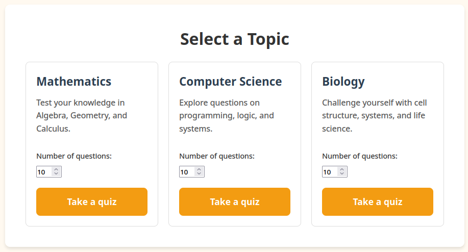

Frontend
========

| The frontend for Edulearn uses the Jinja templating engine, with pages written in HTML/CSS. 
| Some components use JavaScript to enable interactivity.  
| Here's a breakdown of the frontend, page-by-page:  

Navbar/base
-----------
| Using Jinja, we put the navbar into a 'base.html' template that is reused across all pages.  
| The navbar contains link buttons to the quiz, feedback list, and login pages.  
| The navbar is styled to cover the entirety of the top of the screen, and each of the links are styled a little differently:  
* The link to the start quiz form is styled with an orange background so it stands out
* The link to the feedback list has a profile icon (in future, we plan to have individual users be able to view their own feedback)
* The login link is styled plainly - black text on white (with orange text on hover)

Front page
----------
| The front page is the first thing users will see when visiting Edulearn.


| The main goal of this page is simply to push users to the meat of the website - the quiz functionality.
| See below a breakdown of the three major sections:

Hero section
````````````
| The front page has some blurb in a hero section, as well as linking to the start quiz form.
.. code-block:: html

    <section class="hero-section">
        <div class="hero-content">
            <h1>Welcome to EduLearn</h1>
            <p>Your one-stop platform for learning and testing your knowledge.</p>
            <a href="/start_quiz" class="start-learning-btn">Take a quick Quiz</a>
        </div>
    </section>
| Note that the link to start quiz form uses the same styling as the link within the navbar. 
Feature cards
````````````
| There are a couple of swanky styled cards, but the styling is a little fiddly; the feature cards are wrapped in their own dedicated 'features-section', 'features-grid' and 'features-card' classes.
.. code-block:: html

    <section class="features-section">
        <h2>Why Choose EduLearn?</h2>
        <div class="features-grid">
            <div class="feature-card">
                <div class="feature-icon">
                    
                </div>
                <h3>Interactive Quizzes</h3>
                <p>Engaging challenges designed to test and reinforce your knowledge quickly.</p>
            </div>
            <div class="feature-card">
                <div class="feature-icon">
                    
                </div>
                <h3>Track Progress</h3>
                <p>Monitor  your performance over time and see exactly where you can improve.</p>
            </div>
        </div>
    </section>

| The feature cards float up a bit on hover, too:
.. code-block:: css 

    .feature-card:hover {
    transform: translateY(-5px);
   }

Call to action
``````````````
| The call to action section is, essentially, a repeat of the hero section.
| It has its own unique styling which makes it slightly smaller than the hero.

Start Quiz form
---------------
| The start quiz form allows users to choose from 3 different quiz topics.


| There are spinboxes that allow users to pick a value from 3-20:
.. code-block:: html

    <input name="limit" type="number" min="3" max="20" step="1" value="10">

| These three boxes are each actually their own form; when clicked, they send the user to the quiz form, passing through the selected topic and desired number of questions.
.. code-block:: html

    <form action="/quiz" method="GET" class="topic-card" style="display: flex; flex-direction: column;">
        <h2>Mathematics</h2>
        <p style="flex-grow: 1;">Test your knowledge in Algebra, Geometry, and Calculus.</p>
        <div class="module-settings">
            <label>Number of questions:</label>
            <input name="limit" type="number" min="3" max="20" step="1" value="10">
        </div>
        <input type="hidden" name="topic" value="maths">
        <button type="submit" class="submit-btn">Take a quiz</button>
    </form>

| Note the form's 'action' property - this causes the submission to pass through the form's 'limit' and 'topic' values directly to the quiz form page.

Quiz form
---------
| The quiz form displays multiple-choice questions to users, showing them correct/incorrect on answer selection.
| Here's the code for the form itself:
.. code-block:: jinja

    <div class="container">
      <div class="question-box">
        <p id="questionCounter" class="question-counter">Question 1 out of {{ questions | length }}</p>

        
        
        <div class="question" id="question{{ qIndex }}" style="display: none;">
          <h2>{{ question.name }}</h2>
          <form class="quiz-form">
            
            <label class="option">
              <input type="checkbox" name="answer{{ qIndex }}" value="{{ loop.index0 }}">
              <span>{{ option }}</span>
            </label>
            
          </form>
        </div>
        

        <div id="feedback" class="feedback"></div>

        <div class="button-group">
          <button type="button" class="submit-btn" id="nextBtn" disabled>Next</button>
          <button type="button" class="submit-btn" id="finishBtn" style="display: none;">Finish</button>
        </div>
      </div>
    </div>


Feedback list
-------------

Feedback detail view
--------------------

Login form
----------
| In future, we plan to implement a login form.  
| For now, this page simply displays a placeholder form, with some plain HTML text entry boxes.  